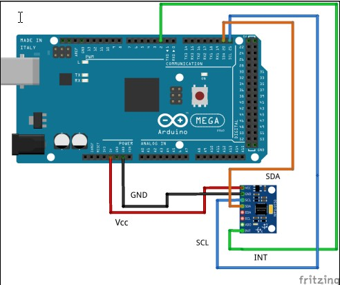

# 5.4 Взаимодействие MPU-9250 с Arduino и ROS

Итак, первый шаг в этом проекте - подключить IMU к Arduino, чтобы получить вращение значений ​​и отправить эти значения в ROS. По сути, мы делаем узел Arduino-ROS, который получает значения IMU и публикует рыскание, тон и крен, а также трансформация \(ТФ\), соответствующая движению ИДУ как темам ROS.

На следующем рисунке показано взаимодействие IMU с Arduino. IMU подключен с использованием протокола I2C:



Подключение Arduino к MPU-9250 показано в этой таблице:


Чтобы начать работу со значениями IMU в ROS, мы должны создать узел ROS-Arduino, который получает значения IMU и отправляет их в виде тем ROS. Надеюсь, вы настроили IDE Arduino в вашей системе. Для запуска этого кода вам понадобится библиотека Arduino для MPU-9250. Обратите внимание, что вы можете использовать библиотеку MPU-9150 для работы с этим IMU, а также можете клонировать файлы этой библиотеки, используя следующую команду:

```text
$ git clone
https://github.com/sparkfun/MPU-9150_Breakout/tree/master/firmware
```

Скопируйте прошивку / I2Cdev и MPU6050 в arduino\_sketch\_location/libraries folder. Местоположение альбом для рисования можно получить из файла \| Параметры IDE.

Скопировав обе эти папки, можно скомпилировать узел ROS-Arduino. Вы можете открыть код из chapter\_5\_codes / MPU9250\_ROS\_DMP. Просто попробуйте скомпилировать код и проверьте, работает он или нет. Надеюсь, вы уже установили последовательную клиентскую библиотеку Arduino ROS , которая называется ros\_lib. Вся процедура была упомянута в главе 4, Управление встроенными платами с помощью ROS.

На следующем рисунке показана блок-схема полного кода. Мы подробно рассмотрим объяснение кода после этого.


