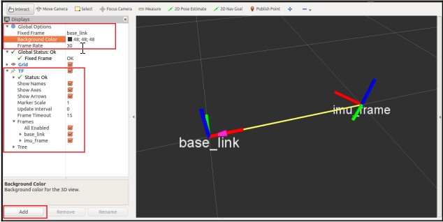

# 5.6 Визуализация IMU TF в Rviz

В этом разделе мы собираемся визуализировать данные TF от Arduino на Rviz. Вот процедура для этого.

Подключите Arduino к ПК и найдите последовательный порт Arduino. Чтобы получить темы из Узла Arduino-ROS, мы должны запустить последовательный сервер ROS на ПК, прослушивая Arduino Серийный порт. Мы сделали это в главе 4 «Управление встроенными платами с помощью ROS». Тем не менее, давайте посмотрим на команды снова в этом разделе.

Первый запуск roscore:

```text
$ roscore
```

Запуск последовательного сервера ROS:

```text
$ rosrun rosserial_python serial_node.py /dev/ttyACM0
```

You can get the following topics when you run the previous node:


Вы можете просто повторить эти темы или визуализировать данные TF на Rviz. Вы можете запустить Rviz, используя следующую команду. Параметр base\_link - это фиксированный фрейм, и мы можем упомянуть, что в самой командной строке.

```text
$ rosrun rviz rviz -f base_link
```

Появится окно Rviz, и, если в левой части Rviz нет опции TF, добавьте его из Добавить \| TF. Вы можете получить визуализацию, как показано здесь, где imu\_frame будет двигаться в соответствии с вращением ИДУ:



