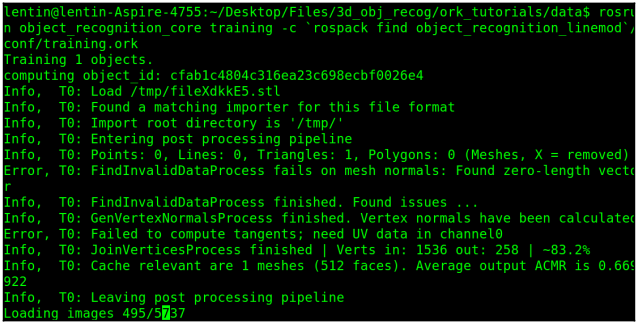

# 6.11 Обучение с использованием 3D-моделей объекта

Мы можем клонировать учебный пакет ORK, используя следующую команду:

```text
$ git clone https://github.com/wg-perception/ork_tutorials
```

Вы можете видеть, что папка ork\_tutorials / data содержит несколько файлов сетки, которые мы можем использовать для обнаружения объекта. Перейдите в эту папку и выполните следующие команды из того же пути. Следующая команда добавит запись в базу данных объектов:

```text
$ rosrun object_recognition_core object_add.py -n "coke" -d "A
universal coke" --commit
```

Имя объекта упоминается после аргумента -n, а описание объекта - после -d. Аргумент -commit предназначен для фиксации этих операций. Когда операция прошла успешно, вы получите ID объекта. Этот идентификатор используется в следующей команде. Следующая команда для загрузки файла сетки объекта в созданную запись:

```text
$ rosrun object_recognition_core mesh_add.py <ID_OF_OBJECT> coke.stl --
commit
```

Вот пример:

```text
$ rosrun object_recognition_core mesh_add.py
cfab1c4804c316ea23c698ecbf0026e4 coke.stl --commit
```

Мы упоминаем название объектной модели - coke.stl - в этой команде, которая находится в папке с данными. Мы не упоминаем  путь, потому что мы уже в нем. Если нет, мы должны указать абсолютный путь модели.

В случае успеха вы получите вывод о том, что модель сохранена в базе данных. Вы хотите увидеть загруженную модель? Вот процедура:

1. Установите couchapp. Пакет распознавания объектов использует couchdb в качестве базы данных.

   Итак, нам понадобится следующее приложение для просмотра модели из базы данных:

```text
$ sudo pip install git+https://github.com/couchapp/couchapp.git
```

2.После настройки приложения вы можете выполнить следующую команду:

```text
$rosrun object_recognition_core push.sh
```

3.Если все прошло успешно, вы получите такое сообщение:

\[INFO\] Visit your CouchApp here: [http://localhost:5984/or\_web\_ui/\_design/viewer/index.html](http://localhost:5984/or_web_ui/_design/viewer/index.html)

4.Щелкните ссылку, и вы получите список объектов и их визуализаций вваш веб-браузер. Вот набор скриншотов этого веб-интерфейса:


Все в порядке! Объектная модель правильно загружена в база данных.

5.После загрузки модели мы должны ее обучить. Вы можете использовать следующие команды:

```text
$ rosrun object_recognition_core training -c `rospack find
object_recognition_linemod`/conf/training.ork
```

6.Если обучение прошло успешно, вы увидите такое сообщение:



