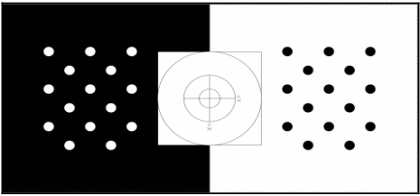

# 6.12 Обучение по захваченным 3D-моделям

Если у вас нет трехмерной сетки объекта, вы также можете создать ее, захватив трехмерную точку облачных данных и реконструируя сетки. Вот шаги для захвата и построения сетки объекта:

1.Перед захватом мы должны распечатать шаблон для лучшего захвата и реконструкции. Вы можете скачать выкройку из [http://wg-perception.github.io/capture/\_downloads/capture\_board\_big\_5x](http://wg-perception.github.io/capture/_downloads/capture_board_big_5x) 3.svg.pdf.



2.Распечатайте выкройку, приклейте ее к твердой доске и поместите на вращающийся механизм, позволяющий вручную вращать доску по оси. Объект должен быть размещен в центре выкройки. Размер рисунка не имеет значения, но чем больше размер, тем лучше обнаружение. Мы можем разместить объект в центре и поместите Kinect так, чтобы он мог обнаруживать все маркеры. Программа захвата захватывает объект только после того, как он обнаружит маркеры. Вот пример выполненной настройки для захвата объекта:


3.Если установка готова, мы можем запустить инструменты для захвата объектного режима. Сначала запустите roscore:

```text
$ roscore
```

4.Запустите узел драйвера Kinect, убедившись, что Kinect правильно включен и подключен к ПК:

```text
$ roslaunch openni_launch openni.launch
```

5.Установите эти параметры для драйвера Kinect ROS:

```text
$ rosrun dynamic_reconfigure dynparam set /camera/driver
depth_registration True
$ rosrun dynamic_reconfigure dynparam set /camera/driver
image_mode 2
$ rosrun dynamic_reconfigure dynparam set /camera/driver
depth_mode 2
```

6.Параметр topic\_toolsrelay в основном подписывается на первую тему и переиздает ее под другим именем. Вы можете запустить следующие две команды на двух Терминалах:

```text
$ rosrun topic_tools relay /camera/depth_registered/image_raw
/camera/depth/image_raw
$ rosrun topic_tools relay /camera/rgb/image_rect_color
/camera/rgb/image_raw
```

Эта команда запустит визуализацию и начнет захват объекта.

7.Выполняя эту команду, вы должны повернуть доску выкройки, чтобы получить максимум возможностей от объекта. Здесь object.bag - это файл bag, используемый для хранения захваченных данных.

```text
$ rosrun object_recognition_capture capture --seg_z_min 0.01 -o
object.bag
```

Вот скриншот операции захвата:


8.Если детектор получит достаточно 3D-данных объекта, он напечатает, что он удовлетворен данными и выйдет.

9.После захвата нам нужно загрузить данные в базу данных.Вы должны укажите имя файла сумки, имя объекта и его описание. Вот пример команды для этого:

```text
$ rosrun object_recognition_capture upload -i object.bag -n
'Tropicana' It is a Tropicana --commit
```

10.Следующим этапом является реконструкция захваченных данных в сетку. Здесь команда для этого:

```text
$ rosrun object_recognition_reconstruction mesh_object --all --
visualize --commit
```

11.Вы увидите преобразование, как показано здесь:


12.Вы можете увидеть облако точек захваченного объекта и изображение во время реконструкции. После реконструкции мы можем обучать модели в базе данных используя следующую команду:

```text
$ rosrun object_recognition_core training -c `rospack find
object_recognition_linemod`/conf/training.ork
```

13.Здесь вы можете использовать разные конвейеры для обучения, такие как tod, tabletop или linemod. Здесь мы использовали конвейер linemod. У каждого конвейера есть свои достоинства и недостатки.

14.После обучения мы можем проверить, загружен ли объект в базу данных, перейдя по следующей ссылке и проверив, выглядит ли она как снимок экрана, показанный после него: [http://localhost:5984/\_utils/database.html?object\_recogn](http://localhost:5984/_utils/database.html?object_recogn)ition/


Следующий процесс - распознавание объекта с помощью обученной модели. Давайте обсудим, как это сделать.


