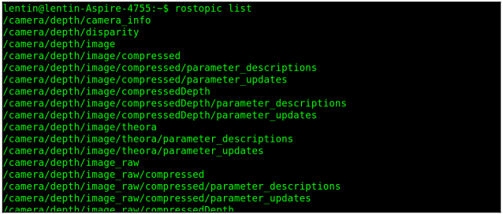

# 6.6 Запуск узлов find\_object\_2d с использованием глубинных датчиков

Используя веб-камеру, мы можем определить только 2D-положение и ориентацию объекта, но что должны ли мы использовать, если нам нужны 3D-координаты объекта? Мы могли бы просто использовать глубинный датчик, как Kinect, и запускать те же узлы. Для взаимодействия Kinect с ROS нам необходимо установить некоторые пакеты драйверов. Kinect может передавать данные как RGB, так и глубины. Используя данные RGB, детектор объекта обнаруживает объект и, используя значение глубины, он также вычисляет расстояние от датчика.

Вот зависимые пакеты для работы с сенсором Kinect:

* Если вы используете Xbox Kinect 360, который является первым Kinect, вам необходимо установить следующий пакет, чтобы заставить его работать:

```text
$ sudo apt-get install ros-kinetic-openni-launch
```

* Если у вас Kinect версии 2, вам может потребоваться другой пакет драйверов, доступно на GitHub. Возможно, вам потребуется установить его из исходного кода. Ниже приведена ссылка на пакет ROS драйвера V2. Инструкции по установке также даются на: https: //github.com/code-iai/iai\_kinect2

Если вы используете Asus Xtion Pro или другое устройство PrimeSense, вам может потребоваться установить следующий драйвер для работы с этим детектором:

```text
$ sudo apt-get install ros-kinetic-openni2-launch
```

В этой книге мы будем работать с Xbox Kinect, первой версией Kinect. Перед запуском драйвера Kinect необходимо подключить USB к компьютеру и убедиться, что Kinect получает питание от адаптера. Как только все будет сделано, вы можете запустить драйверы, используя следующую команду:

```text
$ roslaunch openni_launch openni.launch depth_registration:=true
```


1. Если драйвер работает без ошибок, вы должны получить следующий список тем:




2.Если вы получаете это, запустите детектор объектов и отметьте объект, как вы это делали для обнаружение 2D-объектов. Процедура такая же, но в этом случае вы получите 3D координаты объекта. На следующей диаграмме показано обнаружение объекта и данные о нем на Рвиз. Вы можете увидеть вид сбоку на Kinect и положение объекта в Рвизе.


3. Чтобы начать обнаружение объекта, вам нужно внести некоторые изменения в существующий файл запуска, предоставленный этим пакетом. Имя файла запуска для обнаружения объекта это find\_object\_3d.launch.

Вы можете напрямую просмотреть этот файл по следующей ссылке: [https://github.com/introlab/find-object/blob/master/launch/find\_](https://github.com/introlab/find-object/blob/master/launch/find_)object\_3d.launch. Этот файл запуска написан для автономного робота, который обнаруживает объекты во время навигации по окрестностям.

4.Мы можем немного изменить этот файл, потому что в нашем случае робота нет, поэтому мы можем изменить его таким образом, чтобы информация о TF публиковалась с учетом  Kinect camera\_rgb\_frame, который показан на предыдущей диаграмме. Вот определение файла запуска, которое мы хотим для демонстрации:

```text
<launch>
<node name="find_object_3d" pkg="find_object_2d"
type="find_object_2d" output="screen">
<param name="gui" value="true" type="bool"/>
<param name="settings_path"
value="~/.ros/find_object_2d.ini" type="str"/>
<param name="subscribe_depth" value="true"
type="bool"/>
<param name="objects_path" value="" type="str"/>
<param name="object_prefix" value="object"
type="str"/>
<remap from="rgb/image_rect_color"
to="camera/rgb/image_rect_color"/>
<remap from="depth_registered/image_raw"
to="camera/depth_registered/image_raw"/>
<remap from="depth_registered/camera_info"
to="camera/depth_registered/camera_info"/>
</node>
</launch>
```

В этом коде мы просто удалили статическое преобразование, необходимое для мобильного робота. Вы также можете изменить параметр object\_prefix на название обнаруженного объекта. Используя следующие команды, вы можете изменить этот файл запуска, который уже установлен в вашей системе:

```text
$ roscd find_object_2d/launch
$ sudo gedit find_object_3d.launch
```

Теперь вы можете удалить ненужные строки кода и сохранить изменения. После сохранения этого файла запуска запустите его, чтобы начать обнаружение:

```text
$ roslaunch find_object_2d find_object_3d.launch
```

Вы можете пометить объект, и он начнет обнаруживать отмеченный объект.

5. Для визуализации данных TF вы можете запустить Rviz, сделать фиксированный фрейм/ camera\_link или / camera\_rgb\_frame и добавьте отображение TF с левой панели Рвиз.

6.Вы можете запустить Rviz, используя следующую команду:

```text
$ rosrun rviz rviz
```

Помимо публикации TF, мы также можем видеть трехмерное положение объекта в терминале детектора. Обнаруженные значения положения показаны на следующем снимке экрана:


